:title: OOD Rules
:data-transition-duration: 500
:css: talk.css

----

:id: title-slide

OOD Rules
=========

OOD = Object Oriented Design

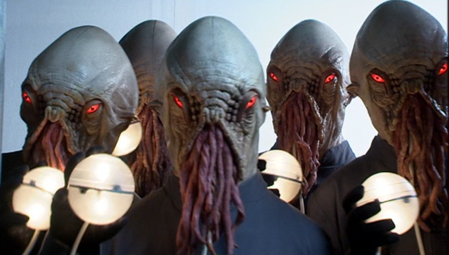

Hamish Downer / @hgd20 / github.com/foobacca / aptivate.org

-----

The Rules
---------

-----

:class: large-code

The Rules
---------

.. code:: python

    assert len(class) <= 100

-----

:class: large-code

The Rules
---------

.. code:: python

    assert len(class) <= 100
    assert len(method) <= 5

-----

:class: large-code

The Rules
---------

.. code:: python

    assert len(class) <= 100
    assert len(method) <= 5
    assert len(method.params) <= 4

-----

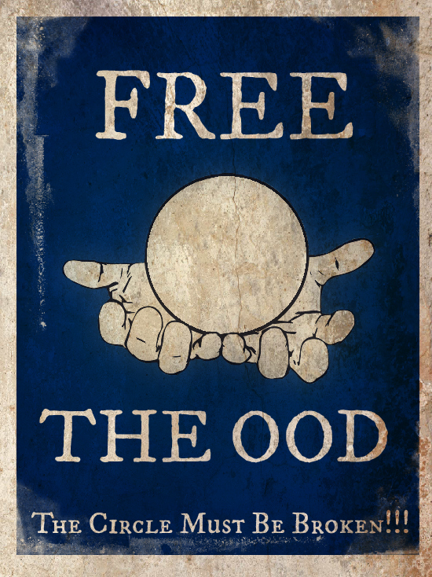

-----

:class: large-code

The Rules
---------

.. code:: python

    assert len(class) <= 100
    assert len(method) <= 5
    assert len(method.params) <= 4

    class Meta:
        # you must persuade your pair
        # if you want to break a rule

-----

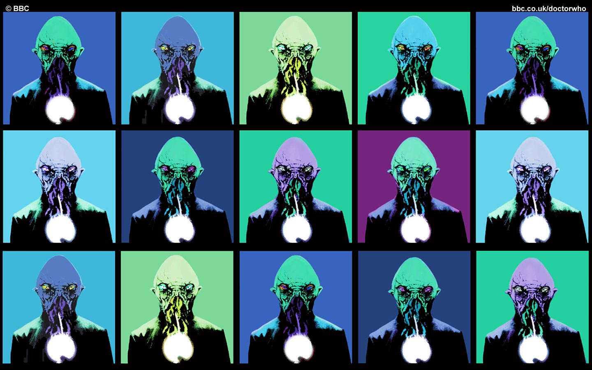

-----

Example Time
------------

------

Planning Work
-------------

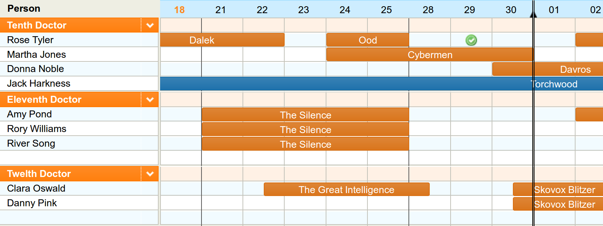

-----

JSON Export
-----------

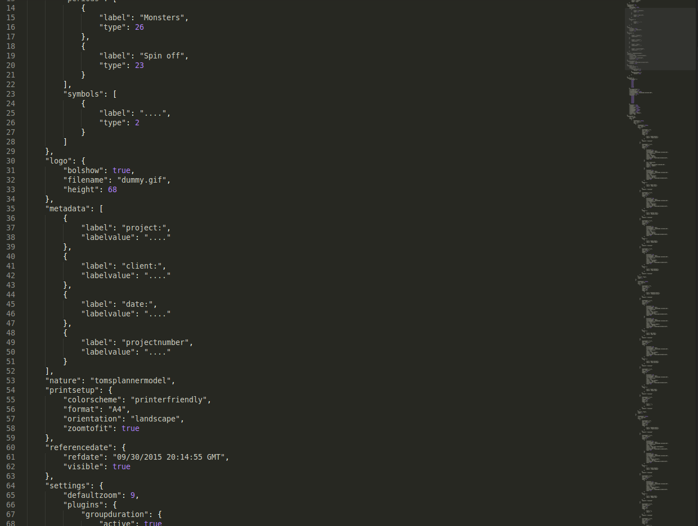

-----

JSON Export Detail
------------------

.. code:: json

    {
        "duration": 8,
        "durationtype": "day",
        "finishmoment": "09/22/2015 17:00:00 GMT",
        "id": "grid_0_33",
        "kids": [],
        "label": "Dalek",
        "nature": "period",
        "startmoment": "09/17/2015 09:00:00 GMT",
        "type": 26
    },

-----

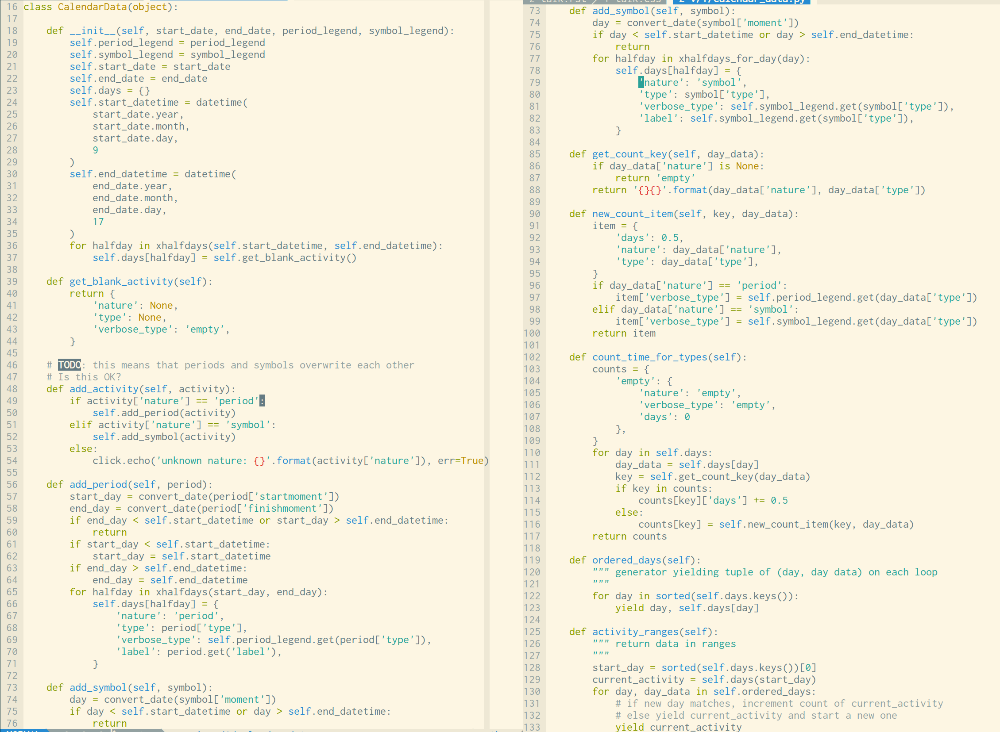

-----

Squint Test
-----------

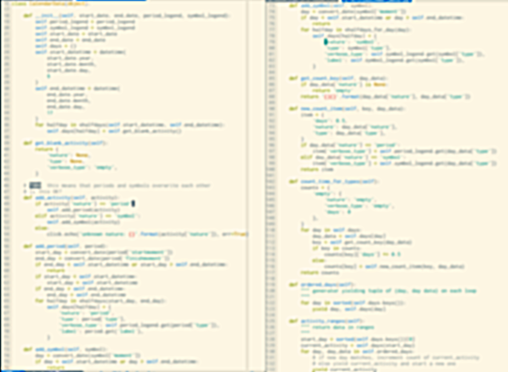

-----

.. code:: python

    def get_blank_activity(self):
        return {
            'nature': None,
            'type': None,
            'verbose_type': 'empty',
        }

    def add_period(self, period):
        # ...
        for halfday in xhalfdays(start_day, end_day):
            self.days[halfday] = {
                'nature': 'period',
                'type': period['type'],
                'verbose_type': self.period_legend.get(period['type']),
                'label': period.get('label'),
            }

    def add_symbol(self, symbol):
        # ...
        for halfday in xhalfdays_for_day(day):
            self.days[halfday] = {
                'nature': 'symbol',
                'type': symbol['type'],
                'verbose_type': self.symbol_legend.get(symbol['type']),
                'label': self.symbol_legend.get(symbol['type']),
            }

-----

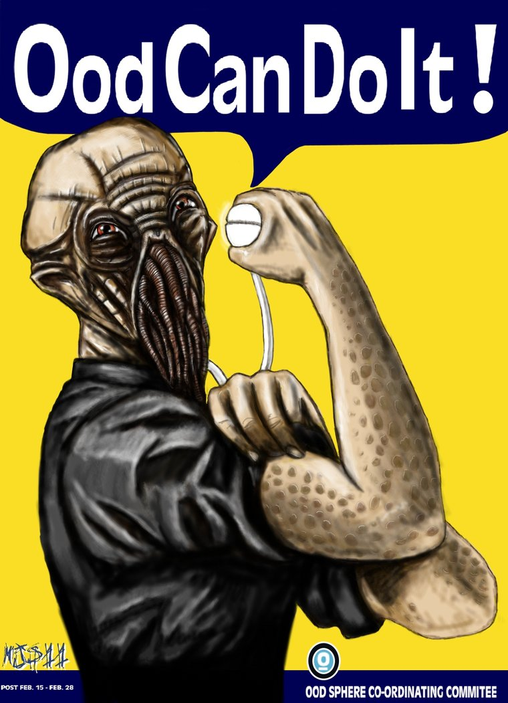

-----

.. code:: python

    class Activity(object):

        def __init__(self, **kwargs):
            self.extra_init(**kwargs)

        def extra_init(self):
            # to be overridden by child classes
            pass

        def __unicode__(self):
            return "{} - {}/{} - {}".format(
                self.nature,
                self.activity_type,
                self.verbose_type,
                self.label
            )

    class EmptyActivity(Activity):
        def extra_init(self):
            self.nature = 'empty'
            self.activity_type = 0
            self.verbose_type = 'empty'
            self.label = 'empty'

        def __unicode__(self):
            return "empty"

-----

.. code:: python

    class PeriodActivity(Activity):
        def extra_init(self, activity_type, verbose_type, label=None):
            self.nature = 'period'
            self.activity_type = activity_type
            self.verbose_type = verbose_type
            if label:
                self.label = label
            else:
                self.label = verbose_type

    class SymbolActivity(Activity):
        def extra_init(self, activity_type, verbose_type):
            self.nature = 'symbol'
            self.activity_type = activity_type
            self.verbose_type = verbose_type
            self.label = verbose_type

        def __unicode__(self):
            return "{} - {}/{}".format(
                self.nature,
                self.activity_type,
                self.verbose_type,
            )

-----

.. code:: python

    def add_period(self, period):
        # ...
        for halfday in xhalfdays(start_day, end_day):
            self.days[halfday] = PeriodActivity(
                activity_type=period['type'],
                verbose_type=self.period_legend.get(period['type']),
                label=period.get('label')
            )

    def add_symbol(self, symbol):
        # ...
        for halfday in xhalfdays_for_day(day):
            self.days[halfday] = SymbolActivity(
                activity_type=symbol['type'],
                verbose_type=self.symbol_legend.get(symbol['type'])
            )

-----

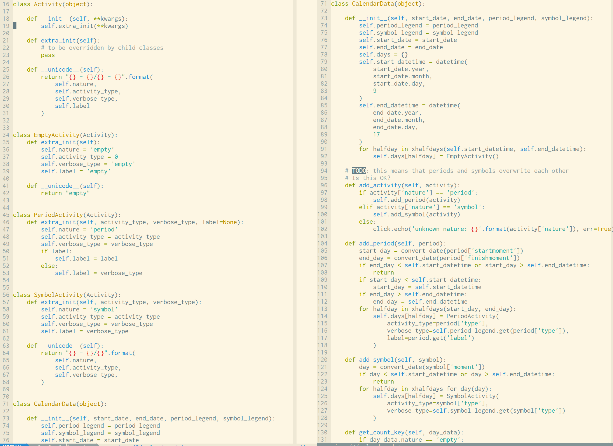

-------

Squint Test Before
------------------

-----

Squint Test After
-----------------

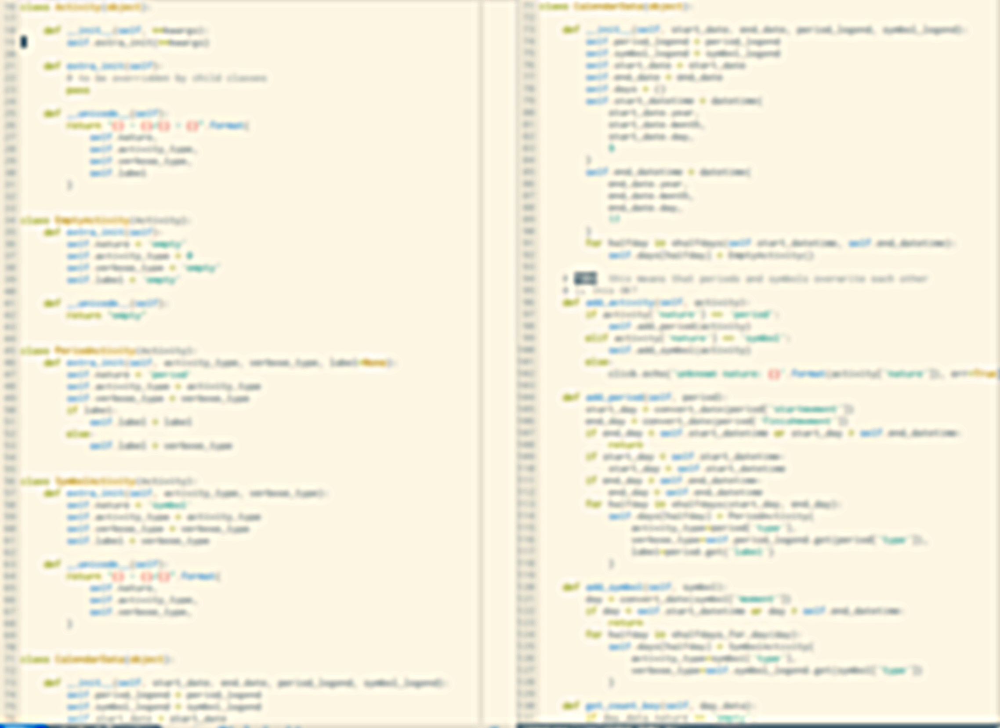

-----------

Inheritance
-----------

Is it a good idea?
~~~~~~~~~~~~~~~~~~

------

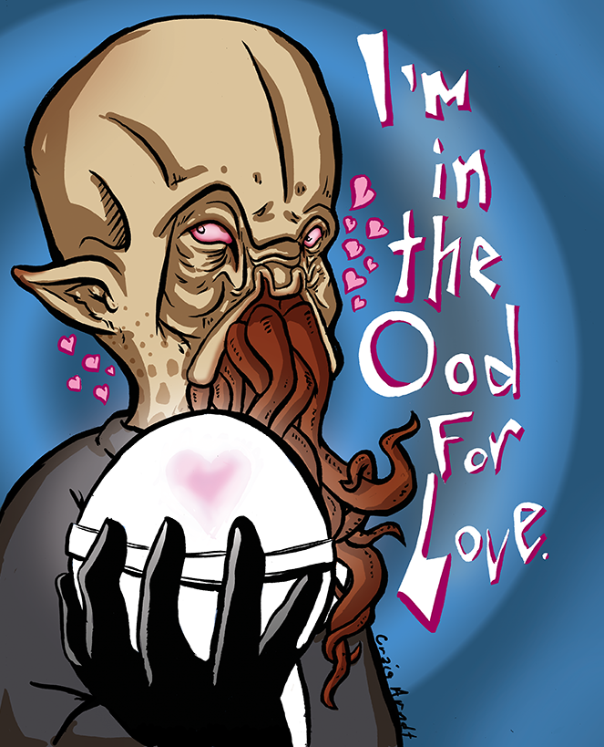

-----

Inheritance
-----------

Shallow and Narrow
~~~~~~~~~~~~~~~~~~

Composition instead of Inheritance
~~~~~~~~~~~~~~~~~~~~~~~~~~~~~~~~~~

------

Django Class-Based Views
------------------------

UpdateView ancestry

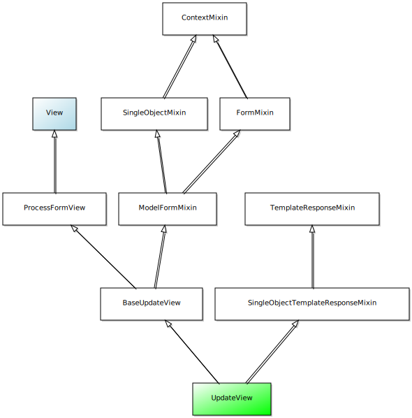

-----------

Open Closed
-----------

* **Open** for extension
* **Closed** for modification

-----------

super() vs extra_init()
-----------------------

.. code:: python

    class Activity(object):
        def __init__(self, **kwargs):
            # ...

    class PeriodActivity(Activity):
        def __init__(self, **kwargs):
            super(SymbolActivity, self).__init__(**kwargs)
            # ...

--------

super() vs extra_init() 
-----------------------

-----------

super() vs extra_init()
-----------------------

.. code:: python

    class Activity(object):
        def __init__(self, **kwargs):
            # ...
            self.extra_init(**kwargs)

    class PeriodActivity(Activity):
        def extra_init(self, **kwargs):
            # ...

-----

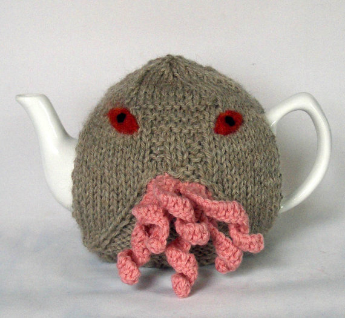

---------

Example 2
---------

---------

.. code:: python

    def halfday_str(day, am_pm):
        return day.isoformat() + '-' + am_pm

    def xhalfdays(start, end):
        """ generator: takes two datetimes, and produces strings like:
            2015-05-28-am
            2015-05-28-pm
            2015-05-29-am
            2015-05-29-pm

        Note it should skip weekends
        """
        start_am_pm = 'am' if start.hour < 12 else 'pm'
        end_am_pm = 'am' if end.hour < 14 else 'pm'
        day = start.date()
        end_day = end.date()
        one_day = timedelta(days=1)

---------

.. code:: python

    # def xhalfdays(start, end):  # continued
        if start_am_pm == 'pm':
            if is_weekday(day):
                yield halfday_str(day, 'pm')
            day += one_day

        while day < end_day:
            if is_weekday(day):
                yield halfday_str(day, 'am')
                yield halfday_str(day, 'pm')
            day += one_day

        if day == end_day and is_weekday(day):
            yield halfday_str(day, 'am')
            if end_am_pm == 'pm':
                yield halfday_str(day, 'pm')

---------

.. code:: python

    class HalfDay(object):
        def __init__(self, day, am_pm):
            self.day = day
            self.am_pm = am_pm

        def increment(self):
            if self.pm:
                return HalfDay(self.day + self.one_day, self.AM)
            else:
                return HalfDay(self.day, self.PM)

        def increment_weekday(self):
            halfday = self.increment()
            while not halfday.is_weekday():
                halfday = halfday.increment()
            return halfday

        def __lt__(self, other):
            return (
                self.day < other.day or (
                    self.day == other.day and
                    self.am and other.pm
                )
            )

        def is_weekday(self):
        def __unicode__(self):

---------

.. code:: python

    class HalfDayIterator(object):

        def from_start_date(self, date_time, weekday):
            am_pm = 'am' if date_time.hour < 12 else 'pm'
            halfday = HalfDay(date_time.date(), am_pm)
            if weekday and not halfday.is_weekday():
                halfday = halfday.increment_weekday()
            return halfday

        def from_end_date(self, date_time):
            am_pm = 'am' if date_time.hour < 14 else 'pm'
            return HalfDay(date_time.date(), am_pm)

        def from_start_end(self, start, end, weekday=False):
            return (self.from_start_date(start, weekday), self.from_end_date(end))

        def xhalfdays(self, start, end):
            half_day, end_half_day = self.from_start_end(start, end, weekday=True)
            while half_day <= end_half_day:
                yield unicode(half_day)
                half_day = half_day.increment_weekday()

----------

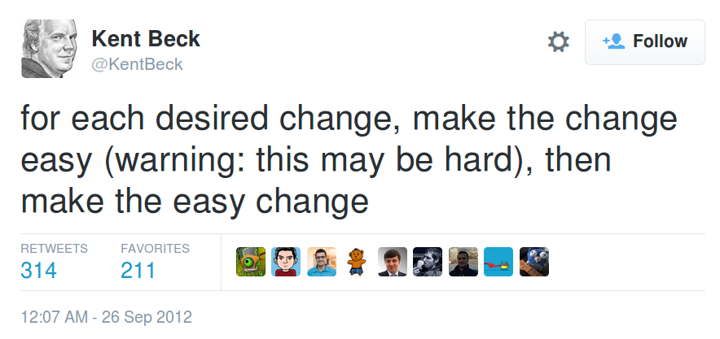

---------

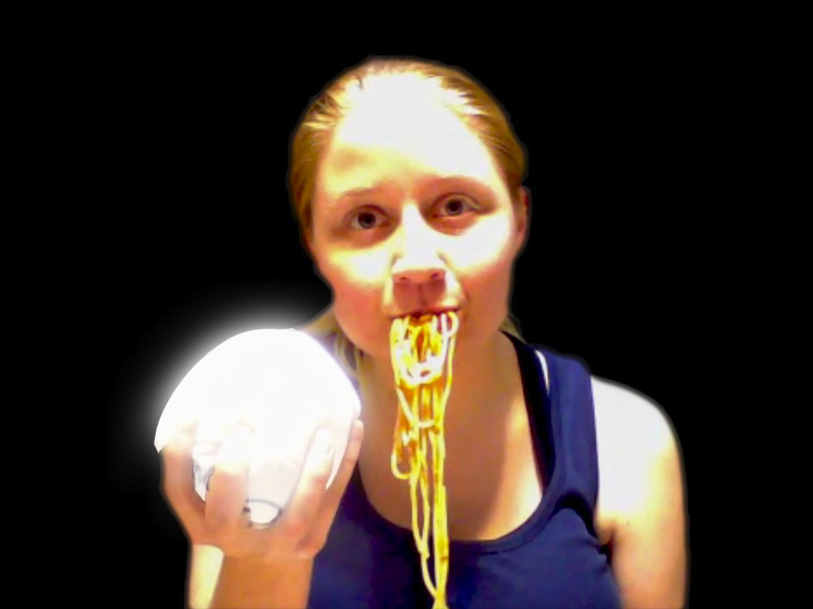

---------

The Rules
---------

:class: large-code

.. code:: python

    assert len(class) <= 100
    assert len(method) <= 5
    assert len(method.params) <= 4

    class Meta:
        # you must persuade your pair
        # if you want to break a rule

-----

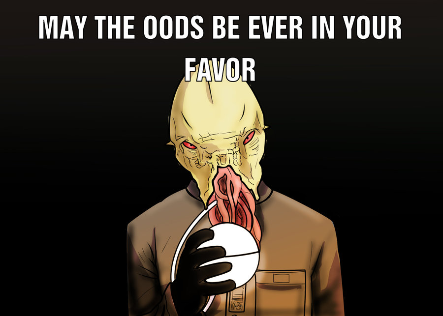

-----

github.com/foobacca/ood-rules-talk

sandimetz.com

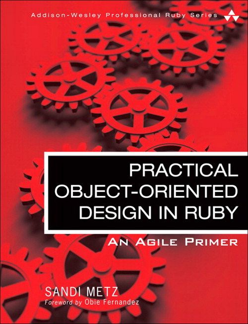

Hamish Downer / @hgd20 / github.com/foobacca / aptivate.org
